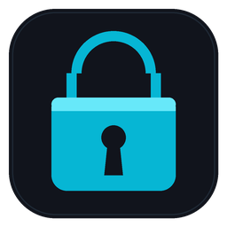

<p align="center">
  
</p>

<h1 align="center">🔐 Password Vault</h1>

<p align="center">
  
  
  
  
  
</p>

<p align="center"><em>v0.7.2 — first upload to GitHub (full history from v0.1.0 in the <a href="CHANGELOG.md">changelog</a>)</em></p>

A lightweight, offline, native-feeling password manager built with **Python + Tkinter + SQLite**.
No cloud sync, no background services, no telemetry — it opens like a calculator or clock,
and every secret it stores never leaves your machine.

## Table of Contents

- [Why this is different](#why-this-is-different-from-most-open-source-password-managers)
- [Features](#features)
- [Security design](#security-design)
- [Project structure](#project-structure)
  - [Where the vault file lives](#where-the-vault-file-lives)
- [Getting started](#getting-started)
- [Building the executable](#building-the-executable-windows)
- [Roadmap](#roadmap)
- [Changelog](CHANGELOG.md)
- [Author](#author)
- [License](#license)

## Why this is different from most open-source password managers

| | Most FOSS password managers | Password Vault |
|---|---|---|
| Footprint | Electron/Qt, 80–200MB installs | Single ~15MB `.exe`, no runtime to install |
| Startup | Splash screens, background daemons | Opens instantly, feels like a native utility |
| Storage | Often a proprietary vault format | Plain SQLite file you can inspect, back up, or move by hand |
| Master password | Sometimes cached in memory indefinitely | Re-derived per prompt; decrypted secrets are wiped from the UI the moment you switch rows, search, lock, or close the app |
| "Main Account" concept | Not offered | First-class idea: link a Netflix/Spotify/etc. login to the Google/Facebook account it actually uses, with one-click autofill |

## Features

- **First-run setup** — creates and confirms a master password; every later launch requires it to unlock.
- **Options menu** — change master password (re-encrypts the whole vault), back up or restore the entire vault file, wipe the vault entirely, lock the vault instantly.
- **Search** — filter by website, username, and/or email.
- **Add / Edit / Delete entries**, including a **Main Account** system:
  - `None` — a fully independent login.
  - `New Main Account` — flags this entry as a reusable identity (e.g. your actual Google account).
  - `Existing Main Account` — pick a previously created Main Account from a dropdown; its email/password autofill and lock, so you can't accidentally desync a linked login. Unchecking clears the fields so you can enter your own.
  - Editing a Main Account's e-mail/password updates every account linked to it, so they never drift out of sync.
  - Editing an entry re-prompts for the master password before the form opens, since the form pre-fills the real stored password.
  - Main Accounts show a "★" before their website name in the table; entries linked to one show "`<website> — <Main Account> linked`" in the Website column, with the Main Account's name in bold.
- **Hidden-by-default passwords** — shown only as dots in the table. Viewing one requires re-entering the master password, and it stays visible until you click Hide Password or the table is rebuilt (search/add/edit/delete/lock/relaunch) — it's no longer masked just by clicking elsewhere.
- **Copy without exposing more than necessary** — select a row and its e-mail becomes directly selectable in the table itself (drag-select, Ctrl+C); viewing a password does the same for that cell. Right-click any row for a Copy Website/Username/E-mail/Password menu as a shortcut. Copying a password still requires the master password if it isn't already revealed.
- **Salting, hashing, and encryption** end-to-end (details below).

## Security design

Two independent cryptographic operations, deliberately kept separate:

1. **Authentication** — the master password is never stored. On creation we generate a
   random 16-byte salt and store `PBKDF2-HMAC-SHA256(password, salt, 390,000 iterations)`.
   Logging in re-hashes the attempt and compares in constant time
   (`hmac.compare_digest`) to prevent timing attacks.

2. **Encryption at rest** — every stored account password is encrypted with
   **Fernet** (AES-128-CBC + HMAC-SHA256, from the well-audited `cryptography`
   library) using a key derived from the master password via a *second*,
   independently-salted PBKDF2 pass. This key is **only ever held in memory**
   for the duration of an unlocked session — it is never written to disk —
   and is re-derived from scratch every time you unlock the vault.

Practical result: an attacker with a copy of `vault.db` but not your master
password gets a file full of random-looking bytes; brute-forcing it means
brute-forcing PBKDF2 at 390,000 iterations per guess, twice.

Changing the master password decrypts every entry with the old derived key
and re-encrypts it with a freshly derived key (new salt) inside a single
database transaction, so the vault is never left half-migrated if something
goes wrong mid-update.

### No account recovery, by design

There is no "Forgot Password" option, no server, and no backup key. This
follows directly from the zero-knowledge design above: if the master
password itself were recoverable through any path, that path would also be
a way to recover every stored password without it, which defeats the point.
**If you forget your master password, the vault's contents are permanently
unreadable** — there is no way back into that specific data.

`Options > Wipe Vault` resets the app to a fresh, just-installed state
(useful for starting over, or before uninstalling/handing off the app) —
but it lives inside the Options menu, which only exists once the vault is
already unlocked, so it can't double as a recovery path if you're the one
who's locked out. In that situation, the practical equivalent is deleting
`vault.db` by hand (see [Where the vault file lives](#where-the-vault-file-lives)
above) and relaunching the app, which starts first-run setup again. Either
way, the app makes you explicitly acknowledge the "no recovery" trade-off
before it lets you create a vault in the first place, and again (twice,
plus your current master password) before Wipe Vault will run.

If some backup data would help, the correct move is `Options > Backup
Database` *before* you forget anything — but note that a backup made with
the same master password is protected by that same password, so it doesn't
change this trade-off; it only protects against losing the file, not
against losing the password.

### Threat model

This vault protects saved passwords against someone who obtains the
`vault.db` file itself — e.g. a stolen laptop, a leaked cloud-synced backup
folder, or a copied drive — **without** the master password. It does not,
and cannot, protect against: malware or a keylogger already running as your
user while the vault is unlocked, someone who obtains your master password
directly (e.g. by shoulder-surfing or coercion), or physical access to a
machine where the vault is currently unlocked.

## Project structure

```
password_vault/
├── main.py                      # entry point
├── assets/
│   ├── icon.ico                  # Windows app/taskbar icon (multi-resolution)
│   └── icon.png                  # PNG version, used in this README
├── app/
│   ├── constants.py              # paths, security parameters, colors/fonts
│   ├── crypto_utils.py           # hashing, key derivation, encrypt/decrypt
│   ├── database.py               # SQLite schema + all CRUD operations
│   ├── session.py                # in-memory unlocked-session state
│   └── gui/
│       ├── app_controller.py     # owns the single Tk root, swaps screens
│       ├── style.py              # centralized dark ttk theme
│       ├── login_window.py       # create-vault / unlock screen
│       ├── main_window.py        # menu bar, search, table, toolbar
│       └── dialogs.py            # add/edit entry, delete, change password, re-auth prompt
├── requirements.txt
├── requirements-dev.txt
├── PasswordVault.spec            # PyInstaller build config
├── LICENSE
├── CHANGELOG.md
└── .gitignore
```

### Where the vault file lives

The database is **not** inside the project folder — it lives in your OS's
standard per-user app-data directory, resolved by
`app/constants.py::get_app_data_dir()`:

| OS | Location |
|---|---|
| **Windows** | `%APPDATA%\PasswordVault\vault.db` (typically `C:\Users\<you>\AppData\Roaming\PasswordVault\vault.db`) |
| macOS | `~/Library/Application Support/PasswordVault/vault.db` |
| Linux | `~/.local/share/PasswordVault/vault.db` (or `$XDG_DATA_HOME` if set) |

It's worth knowing where this is, both so you can back it up yourself outside
the app (in addition to `Options > Backup Database`) and so you can find it
if you ever need to delete it manually. That said, **the file by itself is
useless to an attacker without your master password** — every stored
password inside it is Fernet/AES-encrypted at rest (see
[Security design](#security-design)), and the master password itself is
never written to disk in any form, only a salted hash used to verify it.
Copying, backing up, or even publishing `vault.db` on its own does not
expose your passwords.

## Getting started

```bash
# 1. Create a virtual environment (recommended)
python -m venv .venv
.venv\Scripts\activate        # Windows
# source .venv/bin/activate   # macOS/Linux

# 2. Install the runtime dependency
pip install -r requirements.txt

# 3. Run it
python main.py
```

> **Note:** `tkinter` ships with the standard Python installer on Windows and
> macOS. On some Linux distros you may need `sudo apt install python3-tk`
> (or your distro's equivalent) first.

## Building the executable (Windows)

```bash
pip install -r requirements-dev.txt
pyinstaller PasswordVault.spec
```

This produces `dist/PasswordVault.exe` — a single windowed executable with
no console popup, the cyan padlock icon baked in, and no external
dependencies to install on the target machine. Want a different icon?
Swap out `assets/icon.ico` and re-run the build — `app/constants.py`
resolves the path automatically for both `python main.py` and the frozen
`.exe`, so nothing else needs to change.

## Roadmap

- [ ] Clipboard auto-clear after copying a revealed password
- [ ] Password generator in the Add/Edit dialog
- [ ] Cross-platform packaging (macOS `.app`, Linux `AppImage`)
- [ ] Optional auto-lock after N minutes of inactivity

## Author

**Jade Kester Marcelo**

## License

[MIT](LICENSE) — do whatever you'd like with it, just don't hold the author
liable if you lose your master password (there is, by design, no way to
recover it).
